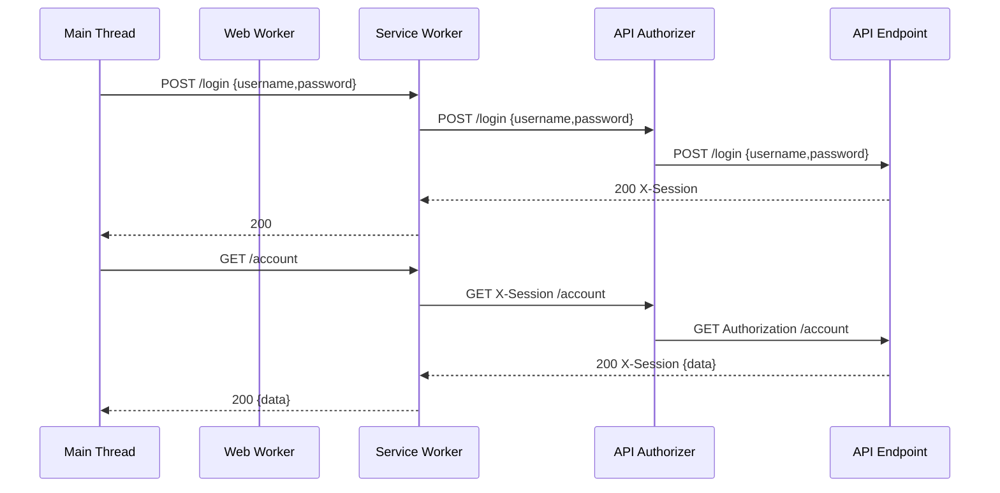

# [WIP] Identity Provider

## Features

## Phases

1. MVP - ASVS L1
2. Alpha - ASVS L2
3. Beta - ASVS L3
4. RC - Add extra features

## Components

- [-] Account
  - [x] create [I]
  - [ ] notifications [III]
    - security - out of band tokens, change notifications, login activity
    - platform actions - invite to join org, action requested, process ready for download,
    - onboard - welcome, getting started, platform tour, book a demo + newsletter
    - software updates - newsletter
    - organization updates - newsletter
- [x] Session [I]
- [x] Credentials [I]
- [-] State Management [I]
- [ ] Agreements [I]
  - Trigger re-agreement after change
  - Checkbox [I]
  - FIDO2 Signature
  - PGP Signature
  - Blockchain Signature
- [x] Username
- [ ] Display Name [I]
- [ ] Group/Organization
  - [ ] Teams
- [ ] Service Worker
  - [ ] Cookie [II]
  - [ ] Token
  - [ ] Push API
  - [ ] WebSocket

### Crypto

Encryption In Use (Symmetric): chacha20-poly1305 w/ random IV
Signature (Symmetric): SHA3-384
Encryption In Use (Asymmetric): ECC P-384
Signature (Asymmetric): Ed25521
Digest: SHA3-384
Hash: Argon2-id w/ { timeCost:3, memoryCost: 2^16, slatLength: 16, outputLen: 64, algorithm: 2, version: 1 }

For each entity (account, messenger, session, etc), each row/object has an encryptionKey (symmetric) that is encrypted using a
shared symmetric encryption key and shared IV. This encryptionKey is used to encrypt specified fields in it's row/object. Digest fields used for lookup (ie username, sid, etc) are encrypted using shared symmetric encryption key and shared IV.

### Messengers (`messenger-*`) (attach to account, allow notifications via, may be used for part of verification)

- [ ] Web Push(es) w/ Out-of-Band verifier [III]
  - Not supported when using incognito mode (https://www.youtube.com/watch?v=ggUY0Q4f5ok)
  - OneSignal
  - PushEngage
  - VWO Engage
  - Google Cloud
- [ ] WebSocket w/ Out-of-Band verifier
- [x] Email address(es) w/ Out-of-Band verifier [I]
- [x] Phone Number(s) w/ Out-of-Band verifier
- [ ] Mobile Push(es) w/ Out-of-Band verifier
- [ ] Address(es) w/ Out-of-Band verifier

### Authenticators (`authn-*`)

- [x] Password w/ credential recovery [I]
- [x] One Time Verifier (RFC3548) (ie TOTP) [II]
- [x] Cryptographic Verifier (ie WebAuthn) [III]
- [x] Lookup Secrets [II]
- [x] Personal Access Token / API Key
- [ ] Authy TOTP
- [ ] SSO
- [ ] Duress password? [https://lwn.net/Articles/867158/]

### Identities (SSO)

- ORCID
- Apple
- Amazon
- Google
- Github
- Microsoft / LinkedIn
- Auth0

### Storage (`store-*`)

- [x] File
- [x] AWS DynamoDB
- [x] SQL (MySQL, PostgeSQL)

### Notifications (`notify-*`)

- [x] File
- [x] AWS SQS
- [ ] Web Push: 3rd Party Service [IV]
- [ ] WS: AWS API Gateway (WebSocket)
- [ ] SMTP: AWS SES
- [ ] SMTP: Office 365 [III]
- [ ] Mobile Push: ???
- [ ] SMS: AWS SNS
- [ ] Voice: Twilio
- [ ] Mail
- [ ] Templates: Long (Email)
- [ ] Templates: Short (Push/WebSocket/Mobile)

### Authorizers (`perm-*`)

- [ ] CASL [II]
- [ ] AWS IAM

## Pages

- [ ] signin: username & password
- [ ] signin: webauthn
- [ ] signin: totp
- [ ] signin: lookup secret
- [ ] forgot password
- [ ] check <messenger> for credential recovery token
- [ ] onboard: name [pii]
- [ ] onboard: email address [pii]
- [ ] onboard: password
- [ ] onboard: check email for out of band token
- [ ] onboard: email address verified from out of band token
- [ ] \_onboard: phone number [pii]
- [ ] \_onboard: check phone for out of band token
- [ ] \_onboard: phone number verified from out of band token
- [ ] \_onboard: username
- [ ] \_onboard: address(es) [pii]
- [ ] onboard: mfa
- [ ] onboard: webauthn
- [ ] onboard: totp
- [ ] onboard: lookup secrets
- [ ] onboard: notifications
- [ ] onboard: success

## Session



## Features Wishlist

- Authentication using:
  - Email & Password (v1)
  - SSO via OIDC (v2)
  - Multi-Factor
    - WebAuthn (Not Supported By AWS)
    - Universal Two Factor (U2F) (Not Supported By AWS)
    - Timed One Time Password via Google (TOTP) (v3)
    - Timed One Time Password via Authy (TOTP)
    - Recovery Codes (Not Supported By AWS)
    - Push Notifications (Not Supported By AWS)
    - Email OTP (Not Supported, Same as Password Reset)
    - SMS OTP (Not Supported, [Insecure](https://www.issms2fasecure.com))
    - Voice OTP (Not Supported, Unencrypted)
    - 3rd Party Message OTP (Not Supported)
    - VOIP OTP (Not Supported)
- Email Registration (v1) and Verification (v2)

- Password Reset (v1)
- Attach a Phone Number and Verification (v3)
- Attach username (v1)
- Security audit trail; records when email, phone, password, mfa (v5)
- Organization (v4)
  - Users can join multiple
  - Users can be grouped into teams
  - Custom Authentication options specific to the organization
  - Set roles
- Teams (v5)
  - For Organizations
  - Nested teams
  - Set roles
- CCPA/GDPR
  - Download Account, trigger bundling user data, with email download link
  - Delete Account, trigger que to remove
- HTML Multipart Emails
  - Verify Email
  - Account created
  - Security notifications (login attempts, login success)
- Notifications via Pinpoint
  - Encrypted emails via PGP - https://www.loginradius.com/engineering/blog/using-pgp-encryption-with-nodejs/
  - SMS notifications
  - Newsletters / Mailing lists
- Accessible (WCAG 2.2) UI (including dark mode) with Lighthouse Score of 100%
- A+ security rating on Mozilla Observatory (CSP, HSTS, etc.)

## Architecture

CloudCraft Image

## Roadmap

### Phase I

- Fully Serverless
- Authentication
  - oidc
  - password
- Create User
- Delete User
- create Session
- manage user profile settings (verify email/phone)

### Phase II

- Organizations
- Authentication
  - totp
  - recovery codes
  - webauthn
  - u2f

### Phase III

- Subject
  - attach team/user

### Phase ?

- ECS Service Option

### Phase ?

- EC2 Secure Enclave Option

## Roles

### Organization

- Owner
- Member
- Billing (Optional)

### Teams

Bring your own

## Terraform

https://github.com/squidfunk/terraform-aws-cognito-auth

This is a template only for configuring Cognito User Pool, Cognito User Pool Client and Cognito User Identity Providers.
Due to limitation of the current version of terraform and circular dependencies, this can not be defined as terraform module at this point.
Recommended way for setting up cognito and api gateway - https://serverless-stack.com

The first step is to create the user pool with the user pool client.

```hcl-terraform

resource "aws_cognito_user_pool" "main" {
  name                = "${local.name}-pool"
  username_attributes = ["email"]

  verification_message_template {
    default_email_option = "CONFIRM_WITH_CODE"
  }

  auto_verified_attributes = ["email"]

  email_configuration {
    reply_to_email_address = "someone@company.com"
  }

  password_policy {
    minimum_length    = 10
    require_lowercase = false
    require_numbers   = true
    require_symbols   = false
    require_uppercase = true
  }

  tags = merge(
    local.tags,
    {
      "Name" = "${local.name}-user-pool"
    }
  )
}

resource "aws_cognito_user_pool_domain" "main" {
  domain       = "domain-test"
  user_pool_id = aws_cognito_user_pool.main.id
}

resource "aws_cognito_user_pool_client" "client" {
  name = "${local.name}-client"
  callback_urls        = ["callback_url1", "callback_url2"]
  default_redirect_uri = "redirect_uri"
  logout_urls          = ["logout_url1", "logout_url2"]
  allowed_oauth_flows_user_pool_client = "true"
  user_pool_id                 = aws_cognito_user_pool.main.id
  supported_identity_providers = ["COGNITO"]
  # supported_identity_providers = ["COGNITO", "Facebook", "Auth0", "Google"]
  allowed_oauth_flows          = ["implicit"]
  allowed_oauth_scopes         = ["phone", "email", "openid", "profile", "aws.cognito.signin.user.admin"]
}

```

Note that the second line for supported_identity_providers is commented out. This needs to be uncommented and after the identity providers are configured and execute terraform apply again.

To add Social identity providers we need to configure them before we can add them to the user pool.
For Facebook configuration follow the steps for "To register an app with Facebook" - https://docs.aws.amazon.com/cognito/latest/developerguide/cognito-user-pools-social-idp.html
After the app is registered the following template can be filled with the actual client_id and client_secret_id and execute
terraform apply to create the Facebook idp.

```hcl-terraform
resource "aws_cognito_identity_provider" "facebook" {
  user_pool_id  = aws_cognito_user_pool.main.id
  provider_name = "Facebook"
  provider_type = "Facebook"

  provider_details {
    authorize_scopes = "public_profile,email"
    client_id        = "*"
    client_secret    = "*"
    attributes_url                = "https://graph.facebook.com/me?fields="
    attributes_url_add_attributes = "true"
    authorize_url                 = "https://www.facebook.com/v2.9/dialog/oauth"
    token_request_method          = "GET"
    token_url                     = "https://graph.facebook.com/v2.9/oauth/access_token"
  }

  attribute_mapping {
    username = "id"
  }
}
```

For Google configuration follow the steps for "To register an app with Google" - https://docs.aws.amazon.com/cognito/latest/developerguide/cognito-user-pools-social-idp.html
After the app is registered the following template can be filled with the actual client_id and client_secret_id and execute
terraform apply to create the Google idp.

```hcl-terraform
resource "aws_cognito_identity_provider" "google" {
  user_pool_id  = aws_cognito_user_pool.main.id
  provider_name = "Google"
  provider_type = "Google"

  provider_details {
    authorize_scopes = "profile email openid"
    client_id        = "*-*.apps.googleusercontent.com"
    client_secret    = "*"
    attributes_url                = "https://people.googleapis.com/v1/people/me?personFields="
    attributes_url_add_attributes = "true"
    authorize_url                 = "https://accounts.google.com/o/oauth2/v2/auth"
    oidc_issuer                   = "https://accounts.google.com"
    token_request_method          = "POST"
    token_url                     = "https://www.googleapis.com/oauth2/v4/token"
  }

  attribute_mapping {
    username = "sub"
  }
}
```

For adding OpenID Connect (OIDC) identity providers follow these steps:
https://docs.aws.amazon.com/cognito/latest/developerguide/cognito-user-pools-oidc-idp.html

For example of using Auth0 as OIDC idp, create new app in Auth0 and configure the following fields:
Domain - hris-viewer.auth0.com
Token Endpoint Authentication Method - Post
Allowed Callback URLs - https://<your-user-pool-domain>/oauth2/idpresponse
Allowed Web Origins - https://<your-user-pool-domain>/
Allowed Origins (CORS) - https://<your-user-pool-domain>/

After creating the app in Auth0, the following terraform template can be used to create the OIDC provider in Cognito, by replacing the actual values.

```hcl-terraform
resource "aws_cognito_identity_provider" "oidc" {
  user_pool_id  = aws_cognito_user_pool.main.id
  provider_name = "Auth0"
  provider_type = "OIDC"

  provider_details {
    authorize_scopes              = "openid email profile"
    client_id                     = "*"
    client_secret                 = "*"
    attributes_request_method     = "POST"
    attributes_url                = "https://hris-viewer.auth0.com/userinfo"
    attributes_url_add_attributes = "false"
    authorize_url                 = "https://hris-viewer.auth0.com/authorize"
    jwks_uri                      = "https://hris-viewer.auth0.com/.well-known/jwks.json"
    oidc_issuer                   = "https://hris-viewer.auth0.com"
    token_url                     = "https://hris-viewer.auth0.com/oauth/token"
  }

  attribute_mapping {
    username = "sub"
  }
}
```

At this point you should be able to test the Cognito web ui with all idp that are configured (including Cognito).
The UI can be accessed at:
https://<your-user-pool-domain>/login?response_type=token&client_id=<client-id-found-in-the-console>&redirect_uri=<redirect-url>

After the user pool is created and configured, if we want to attach the user pool to API gateway this can be accomplished by adding this to the api gateway:

```hcl-terraform
resource "aws_api_gateway_authorizer" "cognito" {
  name          = "cognito-authorizer"
  type          = "COGNITO_USER_POOLS"
  rest_api_id   = aws_api_gateway_rest_api.test_api.id
  provider_arns = [aws_cognito_user_pool.main.arn]
}
```

And the cognito authorizer need to be added to the api gateway methods that need it:

```hcl-terraform
resource "aws_api_gateway_method" "get" {
  rest_api_id = aws_api_gateway_rest_api.kiril_api.id
  resource_id = aws_api_gateway_resource.demo.id
  http_method = "GET"
  authorization = "COGNITO_USER_POOLS"
  authorizer_id = aws_api_gateway_authorizer.cognito.id
}
```

```hcl-terraform
resource "aws_cognito_identity_pool" "main" {
  identity_pool_name               = "IdentityPool"
  allow_unauthenticated_identities = true

  cognito_identity_providers {
    client_id               = "*******"
    provider_name           = "cognito-idp.us-west-2.amazonaws.com/us-west-2_C4Hlmj3zz"
    server_side_token_check = false
  }

  supported_login_providers {
    "graph.facebook.com"  = "****"
    "accounts.google.com" = "****-******.apps.googleusercontent.com"
  }

  #saml_provider_arns           = [aws_iam_saml_provider.default.arn]
  #openid_connect_provider_arns = [aws_cognito_identity_provider.oidc.arn]
}
```

To fully utilize cognito in real world application the callback_urls should be pointing to web application that is going to receive the JWT and then forward it to the API Gateway through the Authorization header.
